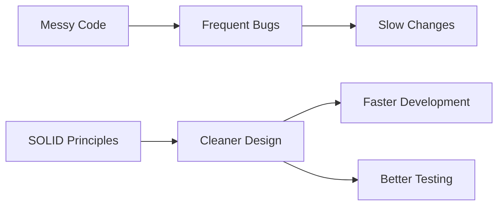
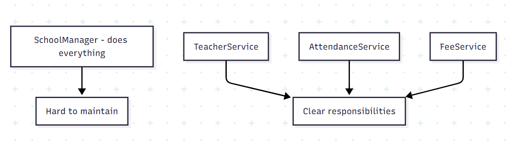
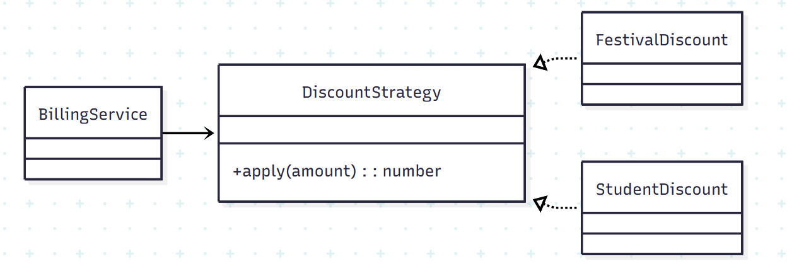
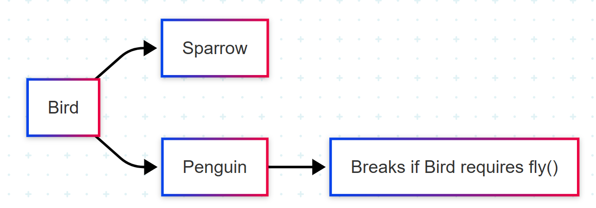
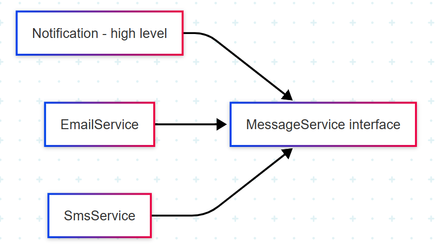

# SOLID Principles (Classroom Notes)

This guide is designed for SOLID in a simple way, with visuals and real-world analogies.

---

## Why SOLID?

SOLID helps us write code that is:

- easy to understand
- easy to change
- easy to test
- safer when requirements grow

Think of SOLID as "good habits" for object-oriented design.



---

## S - Single Responsibility Principle (SRP)

**Rule:** A class should have only one reason to change.

### Real-world example
A school teacher should teach.  
Attendance tracking and fee calculation should be handled by other roles/systems.

### Bad design
One class does:
- student teaching logic
- attendance
- fee reports

### Better design
- `TeacherService` handles teaching
- `AttendanceService` handles attendance
- `FeeService` handles fees

### Design




---

## O - Open/Closed Principle (OCP)

**Rule:** Open for extension, closed for modification.

### Real-world example
A phone charger socket can support new adapters without changing the wall socket itself.

### Code idea
Instead of changing old billing code every time:
- create a `DiscountStrategy` interface
- add new discounts as new classes (`FestivalDiscount`, `StudentDiscount`)

### Design



---

## L - Liskov Substitution Principle (LSP)

**Rule:** A subclass should be replaceable for its base class without breaking behavior.

### Real-world example
If someone says "bring me a bird," giving a penguin should still behave like expected bird behavior in that context.  
If your system assumes all birds can fly, penguin breaks that expectation.

### Design tip
Do not force unrelated behaviors into a base class.

- Bad: `Bird` has `fly()`, then `Penguin` throws error
- Better: separate capabilities like `Flyable`


### Design



---

## I - Interface Segregation Principle (ISP)

**Rule:** Clients should not depend on methods they do not use.

### Real-world example
A printer-only machine should not be forced to implement `scan()` and `fax()`.

### Better design
Split large interfaces:
- `Printable`
- `Scannable`
- `Faxable`


### Design


---

## D - Dependency Inversion Principle (DIP)

**Rule:** High-level modules should depend on abstractions, not concrete classes.

### Real-world example
A remote control should work with any TV brand through a standard interface, not one fixed model.

### TypeScript sample

```ts
interface MessageService {
  send(message: string): void;
}

class EmailService implements MessageService {
  send(message: string): void {
    console.log(`Email: ${message}`);
  }
}

class Notification {
  constructor(private service: MessageService) {}

  notify(msg: string): void {
    this.service.send(msg);
  }
}
```

`Notification` depends on `MessageService` (abstraction), so changing Email to SMS is easy.


### Design



---

## One-Line Memory Trick

- `S`: One class, one job
- `O`: Add new behavior, avoid editing old stable code
- `L`: Child class should not surprise parent users
- `I`: Keep interfaces small and focused
- `D`: Depend on interfaces, not concrete implementations

---

## Quick Classroom Activity (10 mins)

1. Give students a "bad" class (one file with too many responsibilities).
2. Ask them to identify which SOLID rules are violated.
3. Refactor in groups into small classes/interfaces.
4. Present before/after design in 2 minutes per group.

---

## Break Tweeking Questions

- Why is SRP useful in team projects?
- Can you give a real example of OCP from daily life?
- What is a common LSP violation in inheritance?
- Why does ISP improve testability?
- How does DIP help when replacing third-party services?

---

## Final Summary

SOLID is not about making code "fancy."  
It is about making change safe, predictable, and fast.

